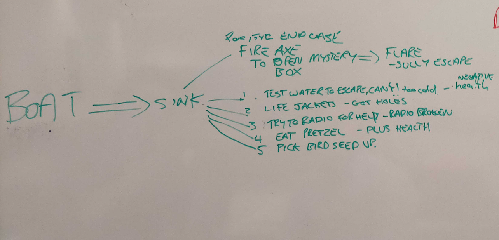
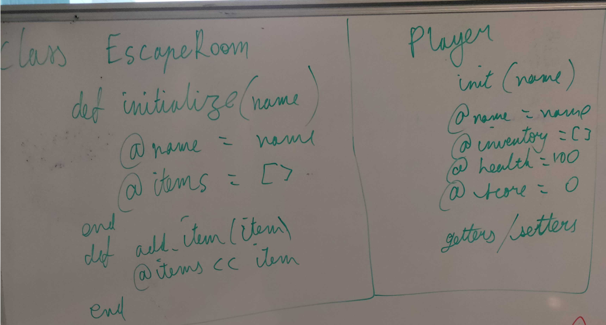
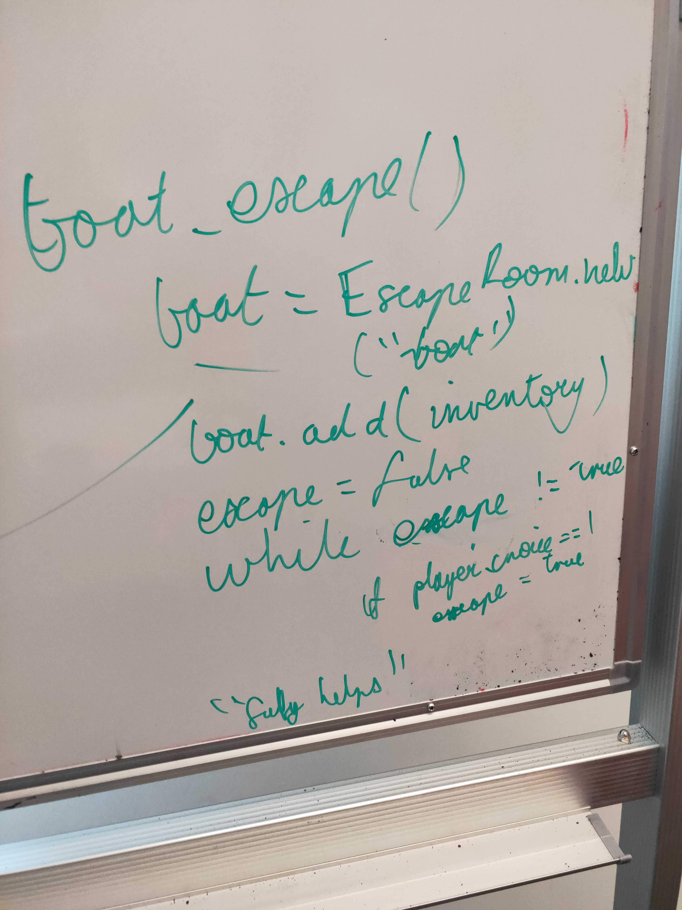
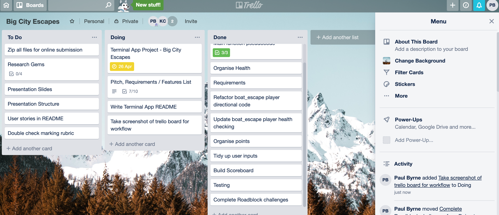

# Terminal App - Big City Escape 
**Pitch** - Big City Escape navigates you through a maze of challenges, roadblocks whilst meeting an array of quirky characters! You will need to keep your wits about you to escape and solve the perils that lie ahead! There is big money up for grabs! "The world is waiting for you. Good luck. Travel safe. Go!"

**Purpose** - The app for people who love adventure and problem solving games and is fun way to kill a couple of minutes. 

**User Stories** 

- As a hardcore player, I want to be able to find the quickest solution without losing health to finish the game.
- As an player, I want to be able to maximise my score to reach the top of the scoreboard and win the ultimate prize.
- As a casual player, I want to be able to relax and solve puzzles in my spare time for 15 minutes.
- As a casual player, I am interested in exploring unique locations and seeing all possible scenarios.
- As a player, I am interested to see which characters present themselves throughout the journey.

**The Game** - The game sets you loose through 3 cities each containing both an escape room and a roadblock challenge. Utilising classes and inheritance to create each escape room truncated the workload and allowed for a clearer structure. Breaking up the locational games into multiple methods increased code readability.

```ruby 
class EscapeRoom

    attr_reader(:name, :items)

    def initialize(name)
        @name = name
        @items = []
    end

    def add_item(item)
        @items << item
    end

    def is_in_items?(item)
        # item is a string

        @items.each do |hash|
            if hash[:item] == item
                return true
            end
        end
        return false
    end

    def remove_item(item)
        # Removes 'item' from @items if 'item' is in @items
        @items.each_index do |index|
            if @items[index][:item] == item
                @items.delete_at(index)
            end
        end
    end

    def to_s()
        return "#{@name} has these items: #{@items}"
    end
end
```

## Designing and Planning -  

### Brainstorming -  
The below picture covers the overall user journey for the player in the boat "escape room challenge"

Early overview of class

Early Boat challenge logic


### Task Management

Using Trello allowed the workflow to proceed naturally and was utilised to check of specs and requirments during the development process.


### Challenges
- Challenge occurred during development of the escape room classes and the logic of the boat_escape function user flow. 
- Refactoring into classes and objects.
- Scoreboard implementation. A simple use of arrays became the solution.

### Future Enhancements

- Include the player's name more often throughout the game to personalise experience.
- Deepen the escape room challenges by introducing more options and route available to the player.
- More cities to explore.
- Ability to check player inventory at any time during an escape room.
- Add more ASCII art.


